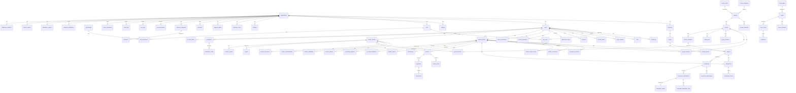

```mermaid
erDiagram
    %% ==================== FOUNDATION ====================
    organizations ||--o{ branches : has
    organizations ||--o{ users : has
    organizations ||--o{ settings : has
    organizations ||--o{ roles : has

    users ||--o{ user_roles : has
    roles ||--o{ user_roles : has
    roles ||--o{ role_permissions : has
    permissions ||--o{ role_permissions : has

    users ||--o{ audit_logs : generates
    users ||--o{ files : uploads

    %% ==================== AUTH ====================
    users ||--o{ login_attempts : has
    users ||--o{ refresh_tokens : has
    users ||--o{ sessions : has
    users ||--o| password_resets : requests
    users ||--o| email_verifications : has
    users ||--o| phone_verifications : has

    %% ==================== STUDENT ====================
    users ||--o| student_profiles : has
    student_profiles ||--o{ student_parents : has
    student_profiles ||--o{ emergency_contacts : has
    student_profiles ||--o{ student_documents : has
    student_profiles ||--o{ student_status_history : has

    %% ==================== TEACHER ====================
    users ||--o| teacher_profiles : has
    teacher_profiles ||--o{ teacher_salaries : has
    teacher_profiles ||--o{ teacher_availability : has
    teacher_profiles ||--o{ teacher_specializations : has
    teacher_profiles ||--o{ teacher_documents : has

    %% ==================== COURSE ====================
    course_categories ||--o{ courses : contains
    course_levels ||--o{ courses : categorizes
    courses ||--o{ course_materials : has

    %% ==================== GROUP ====================
    courses ||--o{ groups : has
    groups ||--o{ group_members : has
    groups ||--o{ group_teachers : has
    groups ||--o{ group_transfers : from
    groups ||--o{ waiting_lists : has
    student_profiles ||--o{ group_members : enrolled_in
    teacher_profiles ||--o{ group_teachers : assigned_to

    %% ==================== SCHEDULE ====================
    branches ||--o{ rooms : has
    groups ||--o{ lesson_schedules : has
    lesson_schedules ||--o{ lessons : generates
    rooms ||--o{ lessons : hosts
    organizations ||--o{ holidays : has
    organizations ||--o{ calendar_events : has

    %% ==================== ATTENDANCE ====================
    lessons ||--o{ attendances : has
    student_profiles ||--o{ attendances : has
    attendances ||--o{ attendance_history : tracks

    %% ==================== HOMEWORK ====================
    lessons ||--o{ homeworks : assigned_in
    homeworks ||--o{ homework_attachments : has
    homeworks ||--o{ homework_submissions : receives
    homework_submissions ||--o{ homework_submission_files : has
    homework_submissions ||--o| homework_grades : graded_as

    %% ==================== EXAM ====================
    exam_types ||--o{ exams : categorizes
    exams ||--o{ exam_questions : has
    exams ||--o{ exam_results : produces
    exam_results ||--o{ certificates : earns

    %% ==================== FINANCE ====================
    organizations ||--o{ payment_plans : has
    student_profiles ||--o{ invoices : billed
    invoices ||--o{ invoice_items : contains
    invoices ||--o{ payments : paid_by
    payments ||--o{ transactions : records
    organizations ||--o{ discounts : offers
    student_profiles ||--o{ scholarships : receives
    organizations ||--o{ expense_categories : has
    expense_categories ||--o{ expenses : categorizes
    teacher_profiles ||--o{ payroll : paid_via

    %% ==================== NOTIFICATION ====================
    organizations ||--o{ announcements : publishes
    users ||--o{ notifications : receives
    notifications ||--o{ notification_reads : tracked_by
    organizations ||--o{ sms_logs : sends
    organizations ||--o{ email_logs : sends
    organizations ||--o{ push_notifications : sends
    organizations ||--o{ telegram_notifications : sends

    %% ==================== REPORTS ====================
    student_profiles ||--o{ student_reports : has
    teacher_profiles ||--o{ teacher_reports : has
    organizations ||--o{ attendance_reports : has
    organizations ||--o{ finance_reports : has
    organizations ||--o{ dashboard_statistics : has

    %% ==================== AI ====================
    users ||--o{ ai_chat_history : uses
    student_profiles ||--o{ ai_recommendations : receives
    student_profiles ||--o{ ai_learning_analytics : analyzed_by
```
